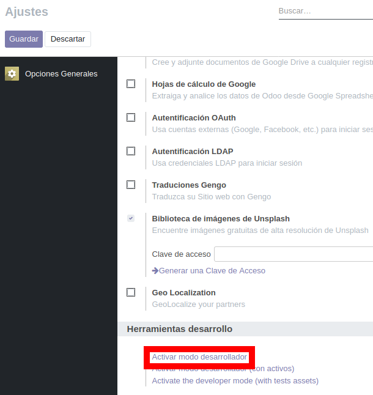
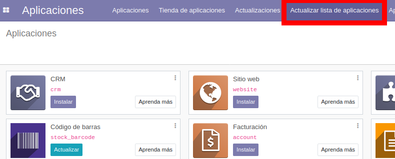

# Localización de Odoo para la empresa Ecuatoriana

_Este proyecto se encuentra en su fase inicial donde se intenta desarrollar los módulos necesarios para que cualquier empresa Ecuatoriana pueda hacer uso de este ERP libre._

## Comenzando 🚀

_Estas instrucciones te permitirán obtener una copia del proyecto en funcionamiento en tu máquina local para propósitos de desarrollo y pruebas._

Mira la sección de **Desarrollo** para conocer como instalarlo.


### Pre-requisitos 📋

_Que cosas necesitas para instalar el software y como instalarlas._

## Odoo

| Version | Soportado?         |
| ------- | ------------------ |
| 13.0    | :white_check_mark: |
| <=12.0  | :x:                |

## Base de datos Postgres

| Version | Soportado?         |
| ------- | ------------------ |
| >=11.7  | :white_check_mark: |
| <=10.12 | :x:                |

### Instalación 🔧

_Una vez instalados los requisitos correctamente_

_Crea una carpeta para guardar tus módulos extra_

```
$ mkdir /../../odoo/extra-addons
```

_clona este repositorio en tu carpeta de modulos-extra_

```
$ git clone https://github.com/ocurieles/odoolec.git /../../odoo/extra-addons/odoolec
```

_Agrega el PATH de tu nuevo directorio en tu archivo de configuración_

```
$ gedit /../../odoo.conf (asegúrate de proveer el PATH correcto y los permisos de ser necesario)

[options]
…………………….
…………………….
addons_path = /../../odoo/addons, /../../odoo/extra-addons/odoolec
```

_Reinicia el servidor_

```
$ sudo service odoo_service_name restart
```

_Ve a a página de incio de sesión de Odoo, ingresa y activa el modo desarrollador_



_Actualiza la lista de aplicaciones_



_Finalmente los módulos aparecerán en la lista de aplicaciones_

_Busca e instala los módulos que necesites_

## Contribuyendo 🖇️

Por favor lee el [CONTRIBUTING.md](https://github.com/ocurieles/odoolec.git/Contributing.md) para detalles de nuestro código de conducta, y el proceso para enviarnos pull requests.

## Wiki 📖

Puedes encontrar mucho más de cómo utilizar este proyecto en nuestra [Wiki](https://github.com/ocurieles/odoolec.git/wiki)
## Autores ✒️


* **Orlando Curieles** - [ocurieles](https://github.com/ocurieles)
* **Osiris Román** - [OsirisRoman](https://github.com/OsirisRoman)
* **Sergio Hidalgo** - [cheo2322](https://github.com/cheo2322)

También puedes mirar la lista de todos los [contribuyentes](https://github.com/ocurieles/odoolec/contributors) quíenes han participado en este proyecto. 

## Expresiones de Gratitud 🎁

* Comenta a otros sobre este proyecto 📢
* Invita una cerveza 🍺 o un café ☕ a alguien del equipo. 
* Da las gracias públicamente 🤓.
* Recomiéndanos para soporte
* etc.
